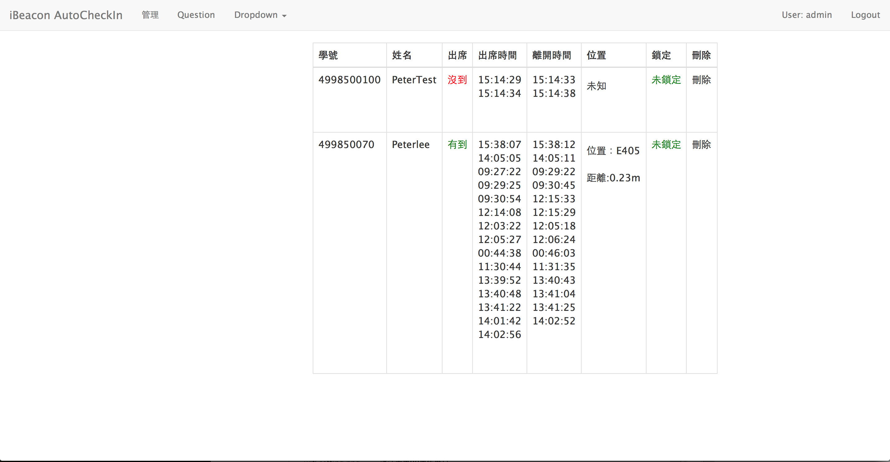
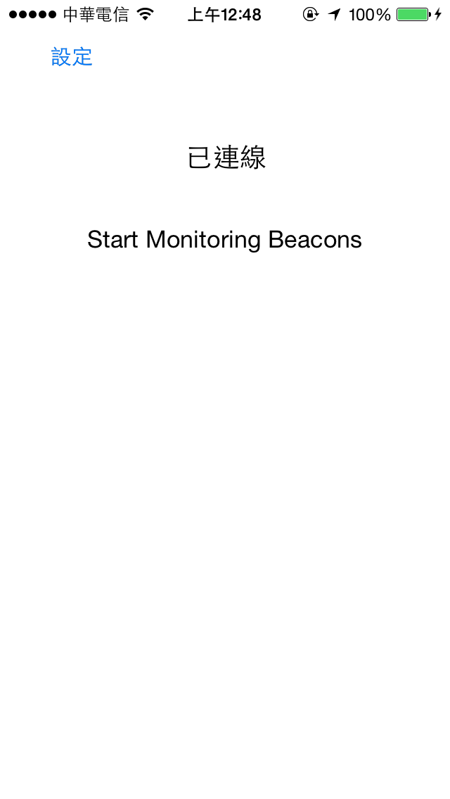

iBeacon_AutoCheckIn
==========

<h2>Feature:</h2>
1:Client:iOS ,Web(Angular.js)   
2:Server:Node.JS + Socket.IO (WebSocket)   
3:DB:Mongoose (mongodb) NoSQL

Install
====

iOS

    //Config.h  
    static NSString *const defaultServer =  @"your server ip";   
    static NSString *const defaultPort = @"your port";

Server(Nodejs)
    
    //public/core.js	
	var socket = io.connect('your server ip:port');
	//example var socket = io.connect('192.168.1.1:8080');

</img>

</img>

