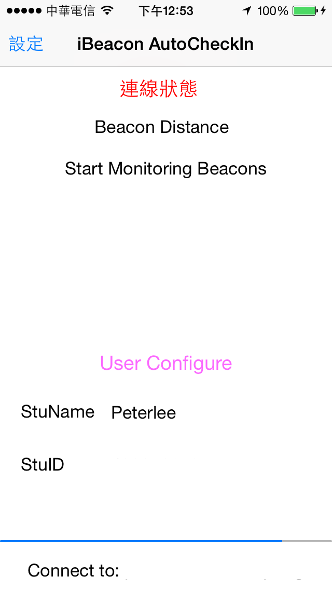
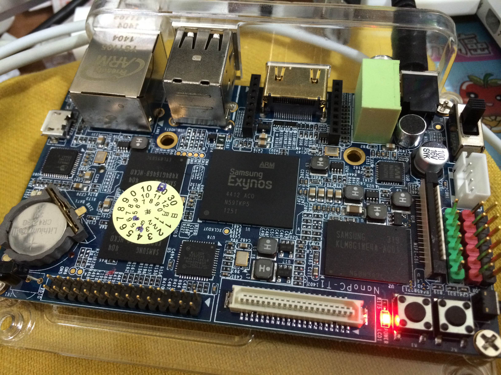
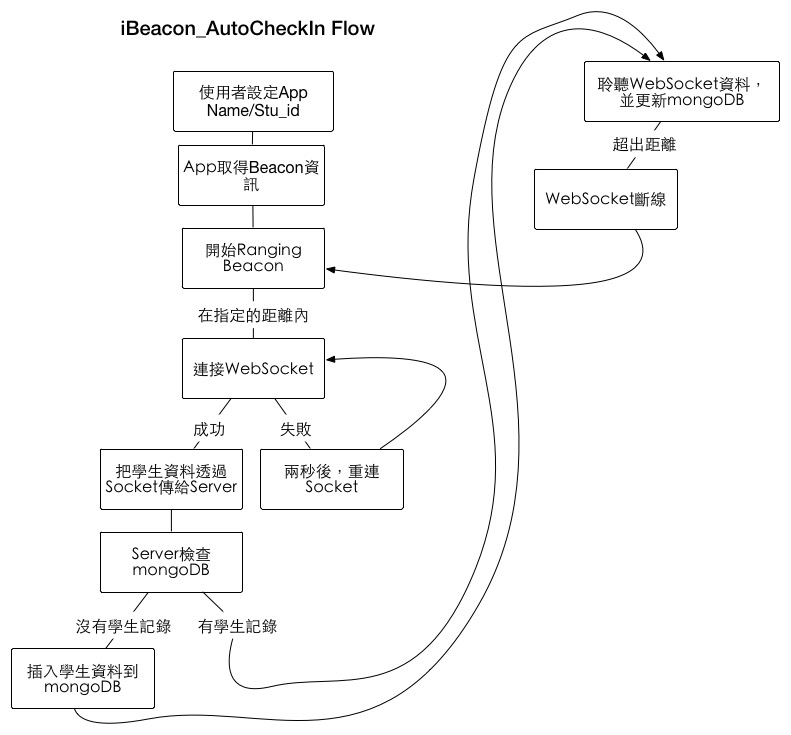

iBeacon_AutoCheckIn
==========

<h2>Feature:</h2>
<h4>1: AutoCheckIn</h4>
<h4>2: Name,ID</h4>
<h4>3: Real time display</h4>
<h4>4: Real time chat</h4>
<h4>5: ...</h4>

<h2>Architecture</h2>

<h4>1:Client:iOS ,Web(Angular.js)</h4>
<h4>2:Server:Node.JS + Socket.IO (WebSocket)</h4>
<h4>3:DB:Mongoose (mongodb) NoSQL</h4>

Install
====
iOS

    // in iBeacon_AutoCheckIn/iOS/iBeacon_AutoCheckIn

    pod install

Server

	//in iBeacon_AutoCheckIn/Server

	npm install

Configure
====

<h3>Default Admin Account</h3>

    account:admin@admin
    password:admin

iOS

    //Config.h  
    static NSString *const defaultServer =  @"your server ip";
    static NSString *const defaultPort = @"your port";

Server(Nodejs)

    //	public/core.js

	var socket = io.connect('your server ip:port');
	//example var socket = io.connect('192.168.1.1:8080');

	//	app.js

	mongoose.connect('mongodb://localhost:27017/iBeaconCheckIn');
	mongoose.connect('mongodb://ip:27017/iBeaconCheckIn');

Start
===
iOS

    iBeacon_AutoCheckIn.xcworkspace

Server

    ./start

<h1>Screen Shot</h1>

<h2>Web</h2>
</img>

<h2>Chat Room</h2>
</img>

<h2>iOS</h2>

</img>
<h3>TouchID unlock</h3>

=======
</img>

<h4>Now my server is running on ARM (NanoPc T1)</h4>
</img>
</img>

<a href="http://redbearlab.com/blemini/">RedBear BLE Mini</a>

</img>

<h2>Library used</h2>

<h4>iOS</h4>

    socket.IO-objc
    SocketRocket
    AFNetworking
    JSMessagesViewController
<h4>Server/Web</h4>

Node.js modules

    express
    socket.io
    mongoose

Client/Web

	angular.js
	jquery
	bootstrap
	socket.io

The MIT License (MIT)

Copyright (c) <2014>  Peterlee

Permission is hereby granted, free of charge, to any person obtaining a copy
of this software and associated documentation files (the "Software"), to deal
in the Software without restriction, including without limitation the rights
to use, copy, modify, merge, publish, distribute, sublicense, and/or sell
copies of the Software, and to permit persons to whom the Software is
furnished to do so, subject to the following conditions:

The above copyright notice and this permission notice shall be included in
all copies or substantial portions of the Software.

THE SOFTWARE IS PROVIDED "AS IS", WITHOUT WARRANTY OF ANY KIND, EXPRESS OR
IMPLIED, INCLUDING BUT NOT LIMITED TO THE WARRANTIES OF MERCHANTABILITY,
FITNESS FOR A PARTICULAR PURPOSE AND NONINFRINGEMENT. IN NO EVENT SHALL THE
AUTHORS OR COPYRIGHT HOLDERS BE LIABLE FOR ANY CLAIM, DAMAGES OR OTHER
LIABILITY, WHETHER IN AN ACTION OF CONTRACT, TORT OR OTHERWISE, ARISING FROM,
OUT OF OR IN CONNECTION WITH THE SOFTWARE OR THE USE OR OTHER DEALINGS IN
THE SOFTWARE.
